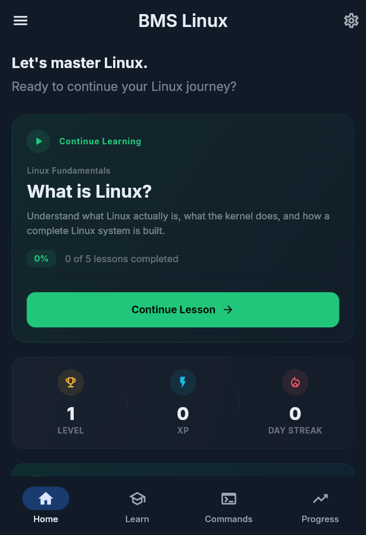
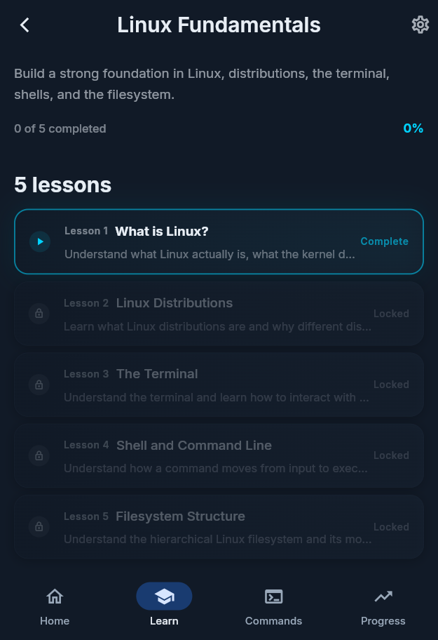
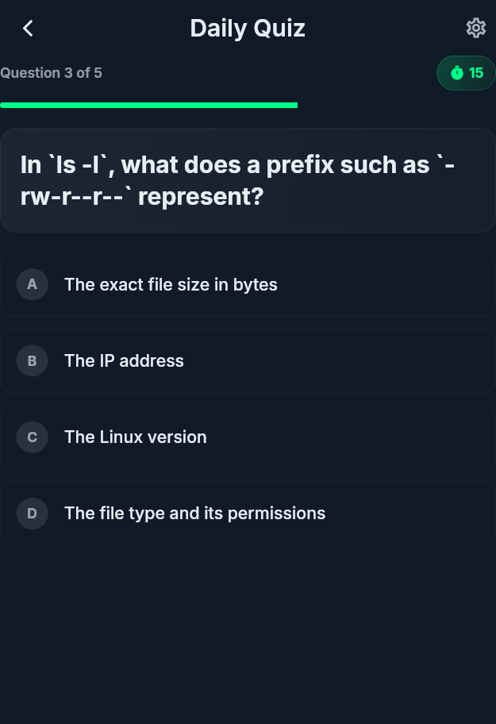
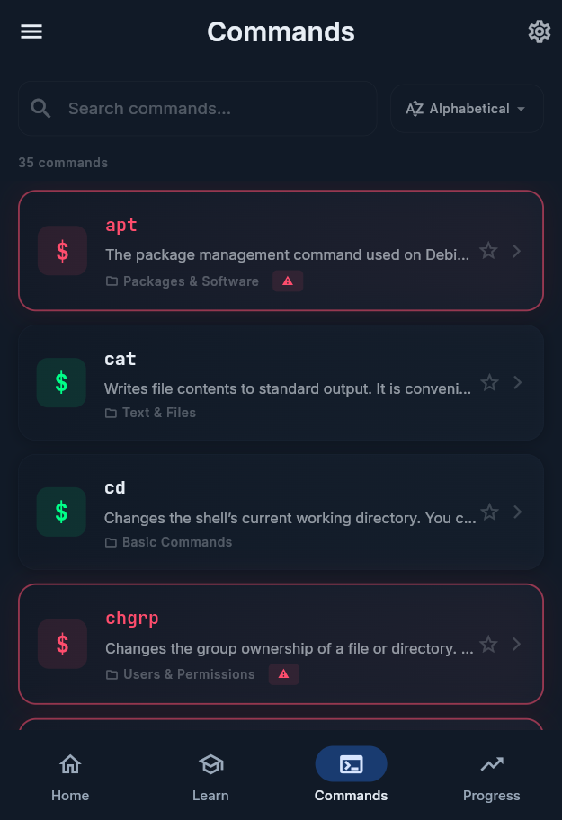
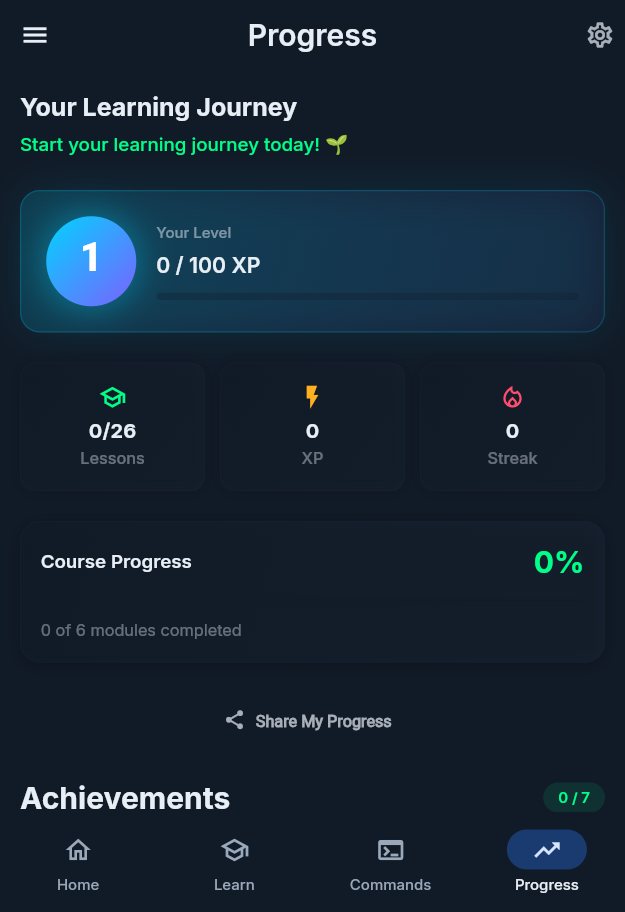
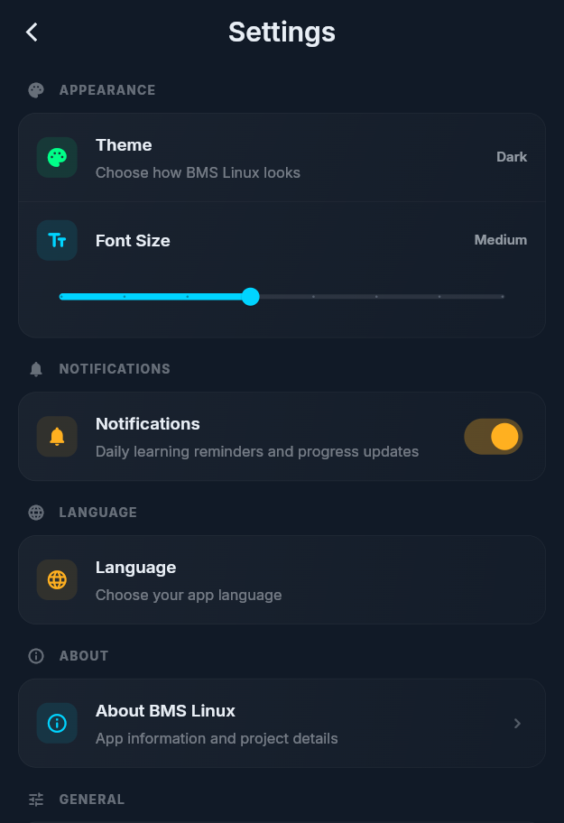

<div align="center">

# 🐧 BMS Linux

### Linux Learning App for Beginners


<br><br>

**Learn Linux. Practice consistently. Build stronger foundations.**

</div>

---

## ⚡ About

**BMS Linux** is a beginner-friendly Android application designed to make Linux easier to learn, practice, and understand.

Instead of presenting Linux as a collection of random commands, BMS Linux provides a structured learning path combining:

`Lessons` · `Commands` · `Practice` · `Quizzes` · `Challenges` · `Progress`

The application is especially designed for students beginning their journey in **Linux, networking, and cybersecurity**.

---

## 📱 Screenshots

<div align="center">





<br><br>





</div>

---

## 🚀 What You Can Learn

### 🐧 Linux Fundamentals

Build a strong foundation before moving into more advanced topics.

* Linux basics
* File & directory management
* Users & permissions
* System concepts
* Command-line fundamentals

### 🌐 Networking

Learn fundamental networking concepts that provide a foundation for future cybersecurity learning.

### 💻 Commands

Explore Linux commands through:

* Explanations
* Examples
* Use cases
* Practical learning
* Risk awareness

### ⚠️ Dangerous Commands

Understand commands that can cause serious system changes or damage when misused.

> **Understand the command. Understand the risk. Know when not to use it.**

---

## 🧠 Learning Experience

BMS Linux combines multiple learning methods:

* 📚 Structured lessons
* 💻 Practical commands
* 🧪 Practice sections
* 📝 Quizzes
* 🎯 Daily challenges
* ⭐ XP & levels
* 🔥 Learning streaks
* 📈 Progress tracking

The goal is to encourage **consistent learning**, not one-time reading.

---

## 📝 Quiz System

The quiz system allows learners to test their understanding after studying each topic.

### Features

* Randomized answer positions
* Automatic scoring
* Passing threshold
* Quiz results
* Progress tracking
* Daily quiz experience

Answer positions are randomized so users cannot depend on a fixed answer position.

---

## 🛡️ Cybersecurity Roadmap

BMS Linux introduces learners to tools they may encounter later in their cybersecurity journey.

### Tools Roadmap

`Wireshark` · `Nmap` · `Burp Suite` · `Metasploit`

`Aircrack-ng` · `Hashcat` · `John the Ripper`

`Nikto` · `Netcat` · `tcpdump`

These tools are currently presented as part of the learning roadmap rather than as fully interactive tools inside the application.

---

## 🔔 Daily Learning

BMS Linux includes local daily learning reminders designed to encourage consistent study.

| Time       | Reminder |
| ---------- | -------- |
| 🌅 Morning | 07:30    |
| 🌙 Evening | 20:30    |

---

## 📈 Progress System

Learning progress is supported through lightweight gamification:

```text
XP
 ↓
Levels
 ↓
Daily Challenges
 ↓
Learning Streaks
 ↓
Progress
```

The goal is to make progress visible without distracting from learning.

---

## 🌍 Language Support

BMS Linux currently supports:

* 🇬🇧 English
* 🇦🇫 Persian / Farsi

Persian uses proper RTL layout while technical terms, commands, and code remain correctly displayed.

---

## 🎨 Design

The application uses a modern, dark-focused interface inspired by the Linux and developer ecosystem.

The design focuses on:

* Clear information hierarchy
* Minimal visual noise
* Technical aesthetics
* Comfortable reading
* Fast access to learning content

---

## 🛠️ Built With

<div align="center">

| Technology                      | Purpose                 |
| ------------------------------- | ----------------------- |
| **Flutter**                     | Application framework   |
| **Dart**                        | Programming language    |
| **Material 3**                  | UI system               |
| **Riverpod**                    | State management        |
| **GoRouter**                    | Navigation              |
| **Hive**                        | Local storage           |
| **SharedPreferences**           | User preferences        |
| **flutter_local_notifications** | Daily reminders         |
| **Timezone**                    | Notification scheduling |
| **Local JSON**                  | Learning content        |

</div>

---

## 📦 Installation

1. Open the **Releases** section.
2. Select the latest release.
3. Download the APK from **Assets**.
4. Install it on your Android device.
5. Open **BMS Linux**.
6. Choose your language.
7. Start learning.

> Android may require permission to install applications from external sources.

---

## 🎓 Who Is It For?

BMS Linux is designed for:

* Linux beginners
* Computer science students
* Networking students
* Cybersecurity beginners
* Windows users learning Linux
* Anyone looking for a structured Linux learning path

**No advanced Linux knowledge is required.**

---

## 🔐 Release Security

This repository contains **release files only**.

The Android release APK is signed using a private release key.

The signing keystore is **not included** in this repository.

---

## 🛣️ What's Next?

The project can evolve with:

* More advanced Linux lessons
* Interactive terminal exercises
* More networking content
* Expanded cybersecurity roadmap
* More quizzes and challenges
* Additional learning paths
* Improved achievements and progress

---

## 📥 Latest Release

### `BMS Linux v1.0.0`

**Platform:** Android
**Release type:** Signed APK

👉 **Download the latest APK from [GitHub Releases](../../releases)**

---

## 👨‍💻 Developer

**Mohammad Younus Noorzai**

Built as a practical learning project focused on:

`Linux` · `Networking` · `Cybersecurity Foundations`

---

<div align="center">

### ⭐ Learn Linux. Practice consistently. Keep building.

</div>
